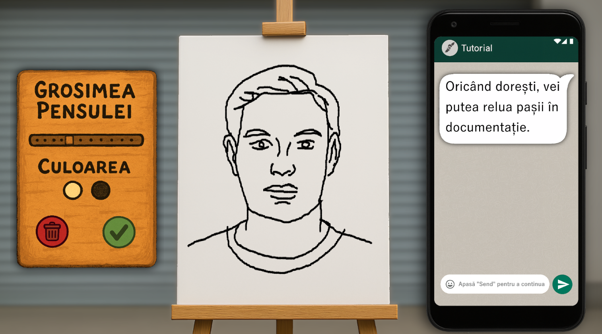

# Documentație Tehnică – PainterShop

## Descriere generală

**PainterShop** este o aplicație educațională creată în Unity, folosind limbajul C#. Aplicația își propune să îi ajute pe utilizatori să învețe cum se desenează un portret digital, într-un mod clar, intuitiv și practic.

Este gândită ca un instrument interactiv de învățare, în care utilizatorul este ghidat pas cu pas în procesul de desen. După aceea, primește evaluări automate dezvoltate cu ajutorul unor algoritmi avansați, fără a fi nevoie de inteligență artificială.

## Structură generală

Aplicația este împărțită în trei mari module:

### 1. Tutorial interactiv

Acest modul oferă explicații de bază despre cum se construiește un portret corect: 

- proporțiile feței,
- poziționarea ochilor, nasului și gurii,
- echilibrul între elementele portretului.

Utilizatorul este ghidat prin instrucțiuni vizuale și pași logici, astfel încât să înțeleagă ușor fiecare etapă.

### 2. Mediu de lucru

Este zona unde utilizatorul desenează efectiv. Oferă:

- o paletă de unelte (pensule, slider pentru grosime),
- o documentație reamintind pașii învățați în tutorial,
- posibilitatea de a folosi imagini de referință.

Totul se face printr-o interfață simplă, potrivită chiar și pentru începători.

### 3. Modul de evaluare

Evaluarea se face automat, fără AI. Sistemul compară desenul făcut de utilizator cu o imagine-țintă, generând automat un contur al acesteia și returnează un scor.

#### Pașii evaluării:

- **Input**: se iau două imagini – una de referință și una desenată de utilizator (exportată din canvas-ul Unity).
- **Preprocesare**: ambele imagini sunt convertite în grayscale (se obține conturul), apoi în format binar (0 = gol, 1 = trasare).
- **Comparare**: se calculează gradul de suprapunere între cele două, folosind algoritmi avansați
- **Rezultat**: se generează un scor final de la 1 la 10, cu două zecimale.

Această metodă este stabilă și obiectivă, evitând problemele legate de interpretarea umană sau imprevizibilitatea unui sistem AI.

## Documentație și suport în aplicație

PainterShop oferă și o zonă de documentație integrată, vizibilă în partea laterală a interfeței, care include informații vizuale din tutorial.

Este practic un ghid mereu la îndemână, care ajută utilizatorul să corecteze greșelile în timp real.

---

## Tehnologii utilizate

- **Unity** – motorul grafic și platforma de dezvoltare,
- **C#** – limbajul principal de programare,
- **Algoritmi binari de procesare a imaginilor** – pentru evaluare (comparare matricială, scoruri de similaritate),
- **Photoshop** - crearea și editarea unor imagini create de inteligența artificială,
- **ThisPersonDoesntExist** - importarea unor imagini cu oameni care nu există, fiind generate de inteligența artificială.

---

## Screenshoturi

